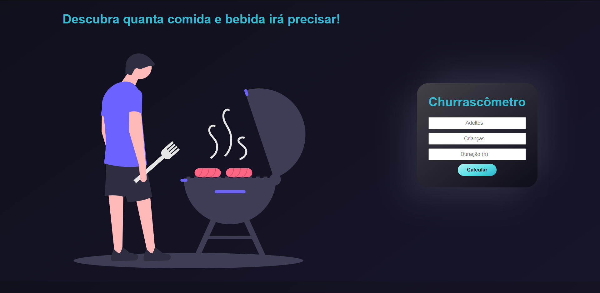
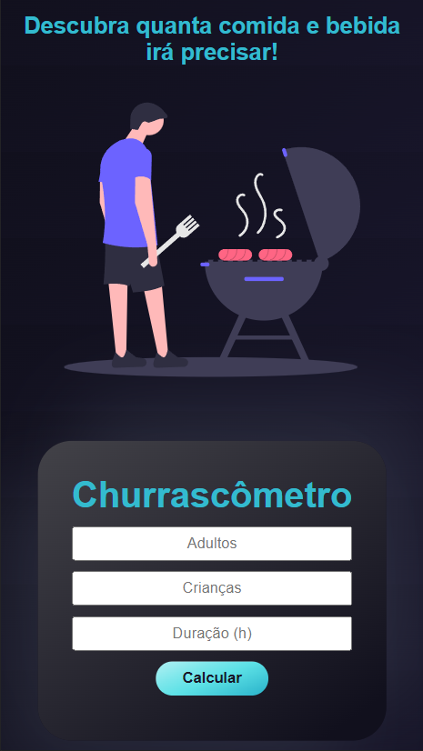
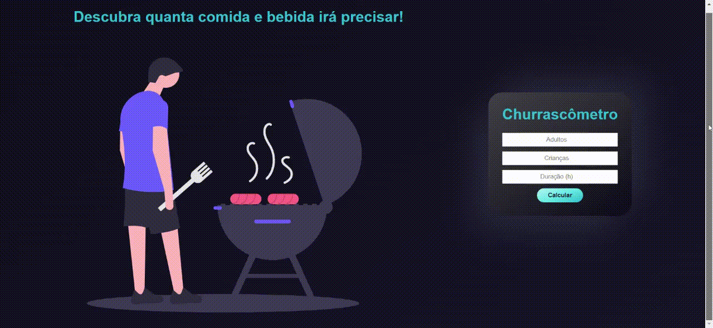

# 📋 Projeto Churrascômetro

## 💎 Introdução

 Você já organziou um churrasco e na hora de comprar a comida pensou: 
"E agora, qual a quantidade de comida e bebida que devo comprar?" 
 
Pois bem, da próxima vez esse projeto poderá lhe ajudar, pois tem como objetivo calcular a quantidade de carne e bebida necessária para a realização de um churrasco.
 
O churrascômetro foi um projeto de estudo de integração de JavaScript com HTML e CSS proposto pelo curso de desenvolvimento web fullstack do ProgramadorBR e tem como base de cálculo os seguintes critérios:
 
* Carne - 400g por pessoa | + de 6 horas - 650g
* Cerveja - 1200ml por pessoa | + de 6 horas - 2000ml
* Refrigerantes / água - 1000ml por pessoa | + de 6 horas 1500ml
* Crianças valem por 0,5.

## 💻 Layout Web

## 📱 Layout Mobile

## 🎥 Animação

# ✅ Tecnologias
* HTML 5
* CSS 3
* JavaScript

# 📝 Autor
https://www.linkedin.com/in/kauan-borotto-7904401a3/